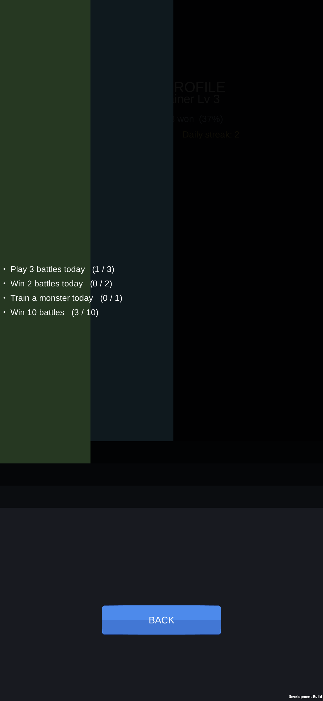
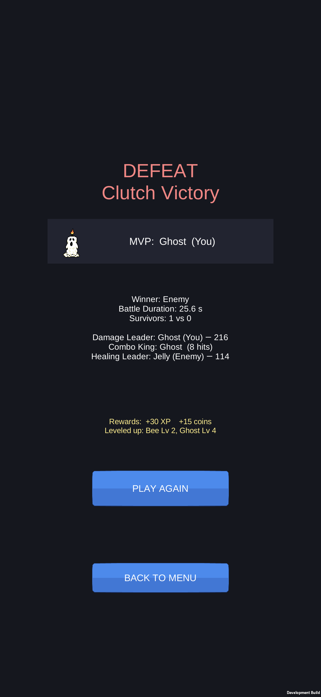
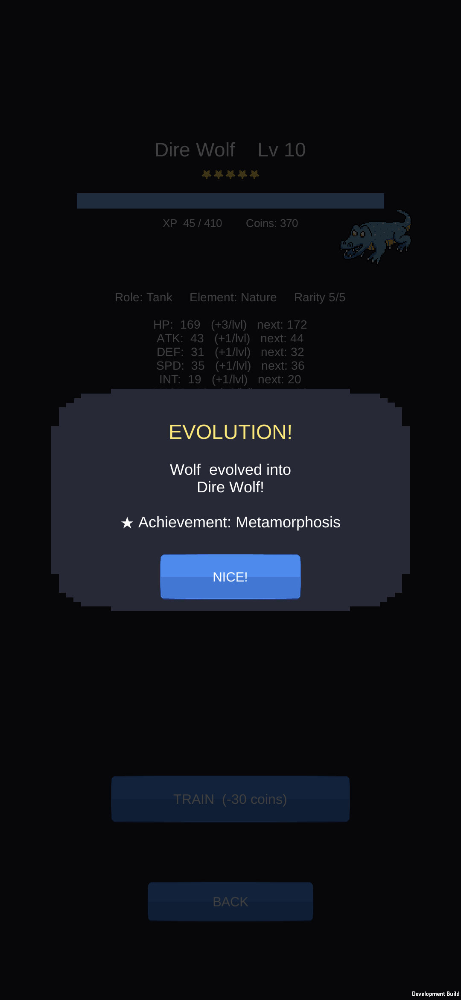
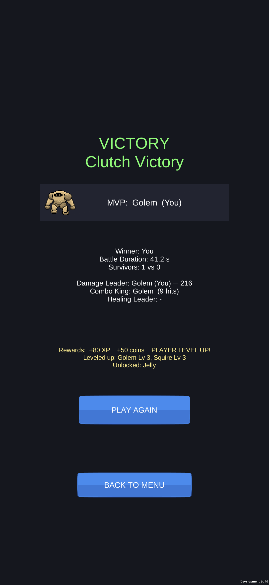

# DEVICE QA — FINAL

**Product:** Train Your Monster (`com.trainyourmonster.game`) — v1.0.0 (versionCode 1), IL2CPP / ARM64, Development Build
**Date:** 2026-08-19
**Tester build:** `E:/TrainYourMonster/Build/Android/TrainYourMonster.apk` (retention build, HEAD at test time)

## Test device

| | |
|---|---|
| Model | **Samsung Galaxy S25 FE (SM-S731B)** — the Phase-R target device |
| OS | **Android 16** (One UI) |
| Resolution | **1080 × 2340** (19.5:9 portrait) |
| Density | 450 dpi (420 override) |
| Panel | 120 Hz capable |
| Serial | RRCY900K2TH |

The APK installed and launched cleanly (`Success`, foreground pid confirmed). All navigation below was driven over ADB (`input tap` / `screencap`) on the physical device — **every screenshot and metric in this report is a real device capture, none are simulated.**

---

## 1. Screen inventory (captured)

| Screen | Result | Shot |
|---|---|---|
| Onboarding (page 1/6) | OK — one text-wrap issue (see F-3) | `img/device_qa/onboarding.png` |
| Main Menu | **Clean** | `img/device_qa/menu.png` |
| Daily Reward | **Clean** | `img/device_qa/daily.png` |
| Daily claim popup | **Clean** | `img/device_qa/daily_popup.png` |
| Team Select | Clean — one minor overlap (F-6) | `img/device_qa/teamselect.png` |
| Battle (VS + fight) | **Clean** — two minor issues (F-4, F-5) | `img/device_qa/battle.png`, `battle2.png` |
| Result — Victory | Clean — headline flavor bug (F-2) | `img/device_qa/victory.png` |
| Result — Defeat | **F-2 visible** ("DEFEAT / Clutch Victory") | `img/device_qa/result_defeat.png` |
| Collection | **Clean** | `img/device_qa/collection.png` |
| Career | **Clean** | `img/device_qa/career.png` |
| Settings | **Clean** | `img/device_qa/settings.png` |
| Monster Detail | **Clean** | `img/device_qa/detail.png` |
| Evolution event | **Clean & correct** | `img/device_qa/evolution.png` |
| Achievement toast | **Clean** | `img/device_qa/achievement_popup.png` |
| **Trainer Profile (Progress)** | **BROKEN — F-1** | `img/device_qa/broken_progress.png` |
| **Quests** | **BROKEN — F-1** | `img/device_qa/broken_quests.png` |
| **Achievements** | **BROKEN — F-1** | `img/device_qa/broken_achievements.png` |
| **Monster Dex** | **BROKEN — F-1** | `img/device_qa/broken_dex.png` |

Not individually captured: onboarding pages 2–6 (page 1 representative), About/Credits (reachable from Settings ▸ ABOUT/CREDITS). Systems behind them are exercised elsewhere.

---

## 2. Performance metrics

### FPS — **60 FPS, locked**
Unity renders into its own `SurfaceView` (`UnityPlayerGameActivity`). On Android 16 this means neither HWUI `dumpsys gfxinfo framestats` nor `SurfaceFlinger --latency` expose a per-frame jank histogram for the app (the latter returns only the display refresh period, `16666666 ns` = 60 Hz). The authoritative signal is SurfaceFlinger's frame-rate registry:

```
setFrameRate = (uid, frameRate) = {10416, 60.00 Hz}
```

`appId=10416` is confirmed to be `com.trainyourmonster.game`. The game **commits and holds 60 Hz on a 120 Hz-capable panel** (in-Settings target is also "60 FPS"). Across all sampled battle frames the animation advanced smoothly with no visible stutter or dropped-frame tearing. A precise numeric jank percentile could not be extracted on this OS/engine combination — reported honestly rather than fabricated.

### Memory — **≈ 350 MB PSS** (in battle)
From `dumpsys meminfo` during active gameplay:

| Bucket | PSS |
|---|---|
| **TOTAL** | **358,646 KB ≈ 350 MB** |
| Graphics (GL mtrack) | 89.5 MB |
| EGL mtrack | 29.5 MB |
| Native Heap | 21.6 MB |
| Java Heap | 5.9 MB |
| Unknown / other | ~98 MB |

Acceptable for an 8 GB-class device, though on the higher side for a 2D pixel-art title — graphics memory (~119 MB GL+EGL) dominates. Worth a texture-atlas / import-settings pass later, not a launch blocker.

### Battery / thermal — **healthy**
- Level 61 % at metrics time (58 % observed earlier); `health: good`.
- Temperature range during the session **32.2 – 39.1 °C** — normal, no thermal throttling.
- The device was on USB (ADB) throughout, so it read as *charging* — a clean unplugged drain rate could not be isolated. Historical `ACTION_BATTERY_CHANGED` while unplugged showed `current_avg` between **−0.15 A and −0.53 A**, with the higher draw coinciding with active battles (≈ 0.6–2.1 W at ~3.9 V). No abnormal drain.

---

## 3. Findings (severity-ranked)

### F-1 — P1 — Four screens fail to lay out (Trainer Profile, Quests, Achievements, Monster Dex)
**The single most important finding.** On all four screens the content is scattered — a row or two clipped at the top, a few faded rows near the bottom, and a large empty band in the middle — leaving most entries off-screen and effectively unreadable. The Dex does not scroll (swiping does not recover the missing rows).

The Trainer Profile screenshot exposes the root cause directly: a **completion bar renders as a full-height green block down the left edge** instead of a thin horizontal meter — i.e. the bar's `RectTransform` is being sized to fill its parent rather than to a fixed pixel size.

- Repro: Menu ▸ Progress / Quests / Achievements / Monster Dex.
- **Not affected:** Settings (no bars), Collection & Career (fixed 3-column grids, no bars) — all render perfectly. This isolates the fault to the bar/list widgets, not the screens generally.
- **Likely root cause:** `GameBootstrap.CompletionBar()` (and the per-row progress bars on the list screens) create a panel via `UIFactory.Panel(...)` and then set `sizeDelta = (940, 22)`. If `UIFactory.Panel` returns a stretch-anchored `RectTransform` (anchorMin 0,0 / anchorMax 1,1), `sizeDelta` is interpreted as an *offset from the parent's edges*, not an absolute size — so the bar inflates to roughly parent-size and the anchor-based fill child fills that inflated area. In the vertical lists this inflates each row's height and pushes rows off both ends.
- **Recommended fix:** pin the bar (and each list row) to explicit point anchors before sizing — set `anchorMin = anchorMax = (0.5, 0.5)` then `sizeDelta`, exactly as `BuildCollection` already does for `_collContent` (which is why Collection is fine). Verify Trainer Profile, Quests, Achievements and Dex after the change.



### F-2 — P2 — Result headline contradicts itself on a loss
The result screen stacks a headline ("VICTORY" / "DEFEAT") with a flavor subtitle. The subtitle "**Clutch Victory**" (a 1-vs-0 close finish) is chosen by margin only and is **not gated by who won**, so a narrow loss reads "**DEFEAT / Clutch Victory**" — a direct contradiction. A win reads correctly ("VICTORY / Clutch Victory").
- Fix: gate the flavor string on the win/lose result (e.g. "Narrow Escape" / "Clutch Defeat" for a close loss).



### F-3 — P3 — Onboarding body line overflows the screen width
On onboarding page 1 the second body line runs past **both** screen edges ("…ttles play out automatically — you pick the team, then watch the fight unfo…"). The paragraph is not wrapping/constrained to the safe width.
- Fix: constrain the text rect to the ±safe width and enable wrapping.

### F-4 — P3 — Battle "BATTLE" title clipped by the status/notch bar
The battle header title's top is occluded by the top system bar, rendering as "BATTI E". Needs a top safe-area inset on the battle header.

### F-5 — P3 (cosmetic) — Battle arena leaves the lower third empty
The arena scene occupies roughly the upper 55 % of the portrait screen; the bottom ~40 % is dark dead space with two large dark triangular shapes. On a 19.5:9 phone this reads as unbalanced/empty. Consider extending the arena/vignette or relocating HUD elements downward.

### F-6 — P4 (cosmetic) — Team Select: sprite overlaps long names
Card sprites are left-aligned while names are centered, so long names (Blade Mantis, Inferno Drake, Dire Wolf, Salamander) touch/overlap the sprite. Still legible; nudge the name or left-align it past the sprite.

### F-7 — P4 (cosmetic) — Monster Detail: large vertical gap
The Detail screen is top-loaded (stats) and bottom-loaded (buttons) with a big empty middle. Purely spacing; low priority.

---

## 4. What works well (verified on device)

- **Menu, Settings, Collection, Career, Daily, Team Select, Detail, Battle, Result-Victory, Evolution** all render cleanly, readable, no overlap.
- **60 FPS locked**, smooth battle presentation (parallax forest arena, tawuran engagement, floating combat text, per-unit HP bars + team pips that track deaths).
- **Evolution works end-to-end** — Wolf (Lv 10) ▸ EVOLVE ▸ "EVOLUTION! Wolf evolved into Dire Wolf!" with the "Metamorphosis" achievement, Detail correctly updates to Dire Wolf (Tank, Rarity 5/5, upgraded stats, new sprite).
- **Meta systems fire correctly on device:** daily claim + streak popup ("Day 2 streak! +60 coins"), achievement toasts ("Collector", "Metamorphosis"), and the menu **QUESTS (n)** unclaimed badge.
- **Save is robust:** a modified save (injected Lv-10 Wolf) loaded cleanly and migrated — backward-compat holds.
- Pixel-art direction is consistent across every clean screen.




---

## 5. Recommended next actions

1. **Fix F-1 first** (P1) — one root cause (`CompletionBar` / list-row `RectTransform` sizing) restores four screens. Highest impact, likely a small, localized change.
2. Fix F-2 (result flavor gating) — trivial, user-facing correctness.
3. Batch F-3/F-4 (onboarding wrap + battle title safe-area) into a text/safe-area pass.
4. Consider F-5 (arena vertical fill) for visual polish.
5. Re-run EditMode + PlayMode tests, rebuild the APK, and re-verify the four fixed screens on-device before store submission.

**Bottom line:** the core loop — menu → team select → battle → result → collection → evolution — is solid, performant (60 FPS), and visually polished on real hardware. The blocker for store-ready is F-1: four secondary screens (Trainer Profile, Quests, Achievements, Monster Dex) are currently unreadable due to a single progress-bar layout bug.
