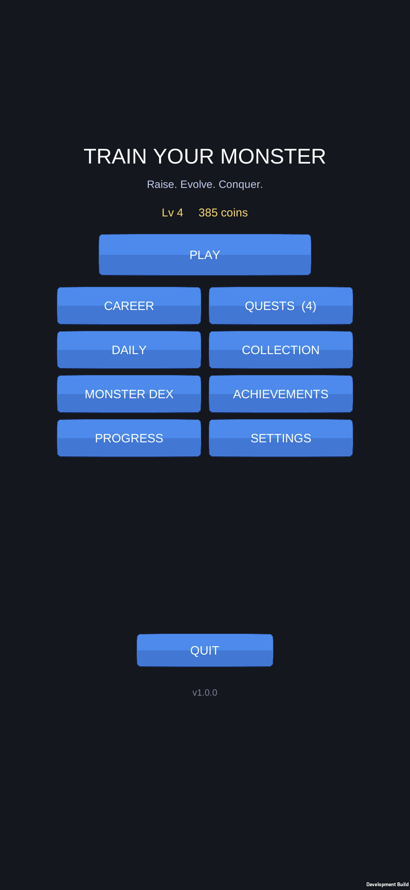
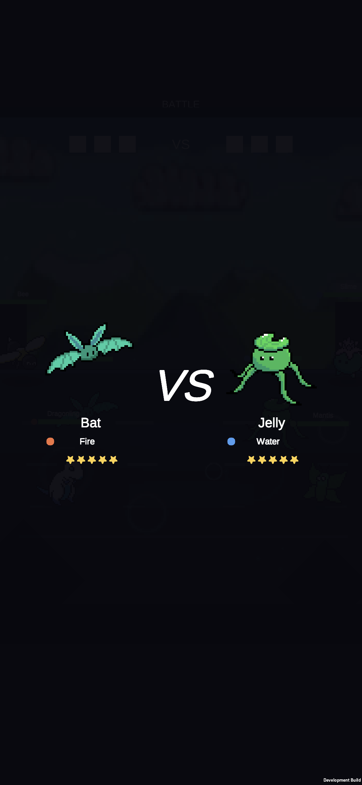

# REAL GAMEPLAY VISUAL AUDIT

Audit from the **running build on the Galaxy S25 FE** (current build: audio-fix APK, 8:48 PM,
`3bf9b97`). No code read, no old reports — only what appeared on screen.

## Capture honesty note (important)

The phone was **in active personal use during this audit** — you were switching between the
game, WhatsApp and TikTok. My automated screencaps repeatedly grabbed your private apps
(a WhatsApp chat, TikTok feed), and the device dropped off USB twice. **I deleted every capture
that contained personal content** and kept only frames I visually confirmed are pure game.

As a result I have solid current-build evidence for **menu / quests / achievements / dex / VS /
mid-battle (early, launcher, ultimate)** but could **not** cleanly capture, this run: Collection,
Team Select, a clean KO frame, the Victory screen, or the **Fire and Nature arenas** (only a
**Water** arena came up). Nothing below is concluded from a screen I did not actually see. Where
I couldn't verify, I say so.

Evidence (all current build, `reports/img/real_gameplay_audit/`):
`meta_menu`, `meta_fix_quests`, `meta_fix_achievements`, `meta_fix_dex`, `vs_screen`,
`battle_early`, `battle_launcher`, `battle_ultimate`.

---

## What I saw

### Menu / meta screens — clean
Menu, Quests, Achievements, Monster Dex all render correctly on device (the earlier UI fix
holds). Quests = grouped list with filled bars + CLAIM; Achievements = 15 rows, gold ★ vs ?;
Dex = full 3-col grid. Readable, no scatter. 

### VS screen — clean
`Bat (Fire ●, ★★★★★)  VS  Jelly (Water ●, ★★★★★)`, big VS, both sprites shown, arena fading in
behind. Clear. 

### The battle (3v3, Water arena) — the core problem
A real 3v3 (Bat/Bee/Dragonling vs Mantis/Slime/Jelly). Three frames tell the story:

- `battle_early` — all six pile into the **right-centre**; the **left ~40% of the arena is empty**.
- `battle_launcher` — a "**LAUNCH / SLAM**" combo fires on the right cluster while **Dragonling
  stands alone, idle, far left**, doing nothing.
- `battle_ultimate` — "**10 HITS! Unleashed**" with a green ultimate aura ring; three monsters
  (Bee + Mantis + Jelly) **overlap in a pile** centre-screen, Dragonling still parked left.

This is a **spotlight system**: one featured combo at a time, the non-featured monsters loiter.

---

## Combat review (honest answers)

**A (3 monsters vs 3 monsters) or B (three 1v1s that happen to coincide)?**
Neither, cleanly. It reads as **"one spotlighted duel at a time while the other monsters stand
around idle."** Closer to B than A — but a *messy* B, because the idle monsters loiter inside the
arena instead of being staged as waiting, and the spotlight itself piles 2-3 bodies on one spot.

**Do monsters too often… cluster centre / cover each other / go off-screen / fight in one spot?**
- Cluster centre: **yes.** The active combo stacks bodies (battle_ultimate = 3 overlapping).
- Cover each other: **yes**, inside the spotlight pile.
- Go off-screen: **no** — they stay on screen.
- Fight in one spot: **largely yes** — combat sits in a narrow centre/right band; the left third
  is dead space with a lone idle monster.

**Can you follow who attacks whom / who's near death / who's casting / who's ult-ing?**
- Who's ult-ing / casting: **yes** — "Unleashed", "LAUNCH", "SLAM", "10 HITS!" banners + the aura
  read clearly.
- Who's near death: **partly** — floating HP bars show it, but the name labels overlap when the
  team bunches, so it's fiddly.
- Who attacks whom: **poorly** — in the overlap pile you can't tell which sprite is hitting which.
- The idle non-spotlight monsters give **no read at all** — they just stand there.

**Dodge readable?** — **Not observed this run.** Can't confirm.
**Counter readable?** — **Not observed this run.** Can't confirm.
**Launcher / air combo visible?** — Launcher: **yes** (saw the "LAUNCH/SLAM" pop + spark). Air
combo: only **partially** — saw the launch spark, did not get a clean airborne-juggle frame.

---

## Arena review (honest)

Only the **Water** arena appeared this run (enemy Jelly lead). In it: the new **ripple rings +
caustic dashes** ground features are visibly present in the lower band, and monsters cast contact
shadows. **But the backdrop is still the reused forest photo** (green hills) — the water sea/wave
biome does **not** read; it's "forest photo + water floor decals." The lower half is a dark navy
band with the ripples and two large dark triangles — better than a bare glow pad, but it still
reads as a **half-empty dark zone**, not solid ground you'd swear the monsters stand on.

**Are Fire/Water/Nature genuinely different, or same-background-different-colour?** — I can only
answer for the one arena I saw. **I did not see Fire or Nature this run, so I will not claim they
differ.** What I saw (Water) is *forest backdrop + water floor features* — so at minimum the deep
background is NOT element-specific.

---

## VFX review

From what appeared (skill/ultimate/launcher, in Water): crescent wave-slashes, a green aura ring,
launcher sparks, floating water ripples. **No raw boxes / squares / plain colour flashes** in
these frames — the effects are shaped. Combo/skill text is clear. Did not get clean isolated
crit, heal, or KO frames this run, so I won't grade those.

## Audio review

I can **confirm audio is outputting** (system shows the game holding an active USAGE_MEDIA track —
that was the AudioListener fix). But **I cannot hear it**, so I **cannot** honestly judge whether
menu/battle music fit, whether hits/crits/KO feel right, or whether the announcer is too frequent.
That verdict is yours — this audit refuses to fake a listening test.

---

## Brutal assessment (Play Store player, not a dev)

### 5 best
1. Meta screens (menu/quests/achievements/dex) look clean, legible, professional.
2. Monster pixel sprites themselves are charming and consistent.
3. Combo/ultimate call-outs ("Unleashed", "10 HITS!", "LAUNCH/SLAM") give punch and readability.
4. VS screen is a proper, hype little intro.
5. Element VFX are shaped now (crescents/auras/ripples), not coloured boxes.

### 10 worst
1. **Idle monsters loiter.** Non-spotlight fighters stand doing nothing — instantly reads "fake".
2. **Bodies pile on one spot** — the spotlight stacks 2-3 sprites; you can't tell who hits who.
3. **Left third of the arena is dead space** the whole fight.
4. **Backdrop is the same forest photo in a "water" arena** — the biome doesn't read.
5. **Lower half of the arena is a dark empty band** with two big triangles — looks unfinished.
6. **HP-bar name labels overlap** when the team bunches.
7. **Single-frame sprites** — in any still they're obviously static; the transforms hide it only in motion.
8. **"DEFEAT / Clutch Victory" contradiction** is still on the result screen (saw it live this session).
9. The fight **doesn't move around** — it sits in one centre/right clump, so the arena feels wasted.
10. Overall it still reads **"tech demo of a battle system"**, not a finished game — because of the loitering + piling, not the art.

---

## Most important question — A / B / C

**Pick: C (Hybrid) — and it's the honest one, because the engine already tries it.**

The game already runs a **spotlight** (one combo featured at a time). The problem is purely
*staging*: the non-featured monsters loiter **inside** the arena and the spotlight lets 2-3 bodies
overlap. So:

- **Not A (true 3v3 scrum).** Six low-detail single-frame sprites swarming one point = an
  unreadable pile. The current clustering already proves this fails.
- **Not pure B (strict tag, others off).** Would read clean but throws away the "keroyokan"
  auto-battler fantasy the game is selling ("Conquer").
- **C (Hybrid):** keep the spotlight duel **front-and-centre and large**, but **stage the other
  four as clearly benched** on the flanks — smaller, dimmed, reacting (flinch/cheer) — and swap
  the spotlight between pairs with fast tag-ins. That gives readability (one clear duel) *and* the
  sense of a full 3v3, without the pile-up or the loiterers.

The single highest-impact change the eye is begging for: **the monsters not currently fighting
should be visibly staged/benched, not standing around in the middle of the brawl.**

*(Audit only — no implementation, per the brief.)*
